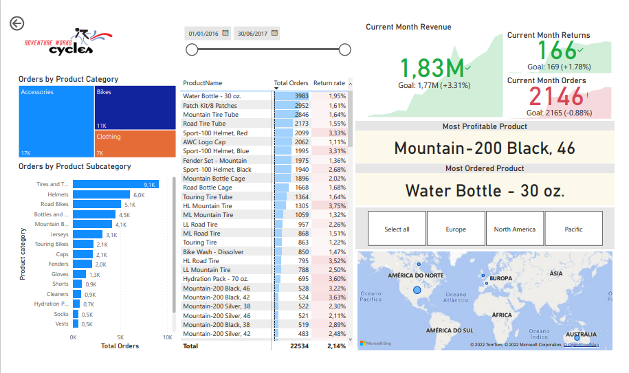
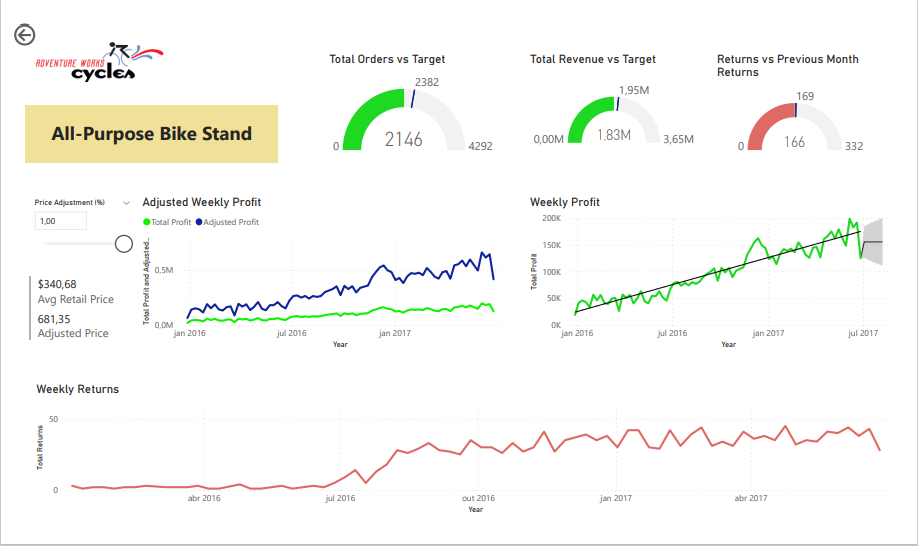

# PowerBI

## Adventure Works Report

This is a report done as part of the [Microsoft Power BI Desktop for Business Intelligence course on Udemy](https://www.udemy.com/course/microsoft-power-bi-up-running-with-power-bi-desktop/). [Click here](https://app.powerbi.com/view?r=eyJrIjoiODdjNWYzZDYtNWNmMS00OWEzLTg4MWUtMmEwYjY4ODE2NDliIiwidCI6ImUyZjc3ZDAwLTAxNjMtNGNmNi05MmIwLTQ4NGJhZmY5ZGY3ZCJ9) to visualize the dashboard.

