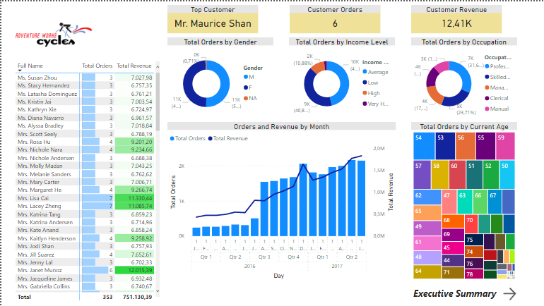
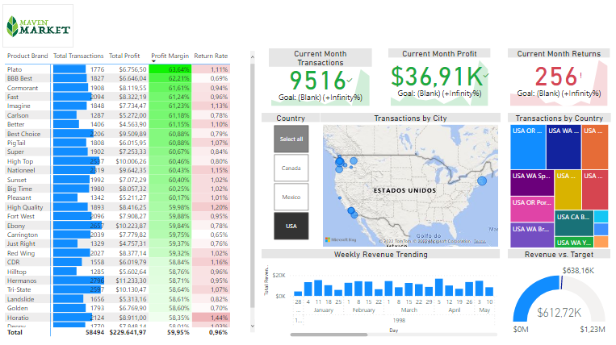

# PowerBI

## Adventure Works Report

This is a report done as part of the [Microsoft Power BI Desktop for Business Intelligence course on Udemy](https://www.udemy.com/course/microsoft-power-bi-up-running-with-power-bi-desktop/). [Click here](https://app.powerbi.com/view?r=eyJrIjoiODdjNWYzZDYtNWNmMS00OWEzLTg4MWUtMmEwYjY4ODE2NDliIiwidCI6ImUyZjc3ZDAwLTAxNjMtNGNmNi05MmIwLTQ4NGJhZmY5ZGY3ZCJ9) to view the interactive dashboard.

## Maven Market Report

This is a report done as a final project for the [Microsoft Power BI Desktop for Business Intelligence course on Udemy](https://www.udemy.com/course/microsoft-power-bi-up-running-with-power-bi-desktop/). [Click here](https://app.powerbi.com/groups/me/reports/7c8c53dd-8462-49ea-8bda-dd15dc0ce71d/ReportSection) to view the interactive dashboard.

